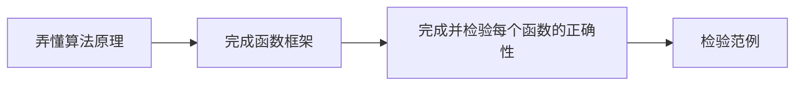

# 5_ARAP(as rigid as possible)掌握一个框架最好的方法就是直接用它

### 离散微分几何

相容定理：采样频率足够高 

### 几何建模和处理

3DS Max (软件)

建模： 多视点几何学 、IBM商业化软件、CAD建模、深度相机、3D物体的重建

图像重建、Mesh Smoothing(denoise)、Mesh Simplification、Surf Editing、Mesh Morphing

几何、仿真、渲染

Local Global(ALS、ADMM)

实现步骤：

看懂ARAP算法


### ASAP实现方法

$A_t$是三角形的面积$(t=1,2,...,T)$,$x_t={\{x_t^0,x_t^1,x_t^2}\}$是三角网格的等距参数化，2D坐标$u_t={\{u_t^0,u_t^1,u_t^2}\}$,得到能量：
$$
E(u,L)=\sum_{t=1}^{T}A_t||J_t(u)-L_t||_F^2
$$
根据Pinkall and Polthier，可转换为:
$$
E(u,L)=\frac{1}{2}\sum_{t=1}^{T}\sum_{i=0}^{2}cot(\theta_t^i)||(u_t^i-u_t^{i+1})-L_t(x_t^i-x_t^{i+1})||_F^2
$$
这里
$$
L_t\in{M}=\left \{  \begin{pmatrix}
a  &b \\
-b  &a
\end{pmatrix}:a,b\in{R}\right \}
$$
对$u,a,b$分别求偏导可以得到：
$$
\sum_{j\in{N(i)}}(cot(\theta_{ij})+cot(\theta_{ji}))(u_i-u_j)=\sum_{j\in{N(i)}}(cot(\theta_{ij})L_{t(i,j)}+cot(\theta_{ji})L_{t(j,i)})(x_i-x_j),\forall{i=1,2,...,n}
$$
其中$t(i, j)$是包含半边$(i, j)$的三角形，$θ_{ij}$是$t(i, j)$中的对角$(i, j)$，即：
$$
\sum_{j\in{N(i)}}(cot(\theta_{ij})+cot(\theta_{ji}))(u_i-u_j)
=\sum_{j\in{N(i)}}(cot(\theta_{ij})L_{t(i,j)}+cot(\theta_{ji})L_{t(j,i)})(x_i-x_j),\forall{i=1,2,...,n}
$$

记$u^i-u^{i+1}=\begin{pmatrix}
\Delta{u_x^i}   \\
\Delta{u_y^i}
\end{pmatrix}$，$x^i-x^{i+1}=\begin{pmatrix}
\Delta{x_x^i}   \\
\Delta{x_y^i}
\end{pmatrix}$，并且令$\frac{\partial{E}}{\partial{a}}=0$和$\frac{\partial{E}}{\partial{b}}=0$，对每个$t$可得：
$$
\begin{cases}
a=\frac{C_2}{C_1}
\\b=\frac{C_3}{C_1}
\\C_1=\sum_{i=0}^{2}cot(\theta^i)((\Delta{x_x^i})^2+(\Delta{x_y^i})^2)
\\C_2=\sum_{i=0}^{2}cot(\theta^i)((\Delta{u_x^i})(\Delta{x_x^i})+(\Delta{u_y^i})(\Delta{x_y^i}))
\\{~~~~}=\sum_{i=0}^{2}u_x^i(cot\theta^i\Delta{x_x^i}-cot\theta^{i-1}\Delta{x_x^{i-1}})+u_y^i(cot\theta^i\Delta{x_y^i}-cot\theta^{i-1}\Delta{x_y^{i-1}})
\\C_3=\sum_{i=0}^{2}cot(\theta^i)((\Delta{u_x^i})(\Delta{x_y^i})-(\Delta{u_y^i})(\Delta{x_x^i}))
\\{~~~~}=\sum_{i=0}^{2}u_x^i(cot\theta^i\Delta{x_y^i}-cot\theta^{i-1}\Delta{x_y^{i-1}})-u_y^i(cot\theta^i\Delta{x_x^i}-cot\theta^{i-1}\Delta{x_x^{i-1}})
\end{cases}\quad{t=1,2,...,T}
$$
结合公式$(4)、(5)$，故可以得到$(2n+2T)$行的稀疏方程，利用Sparse矩阵的求解方法即可得到解

### 处理细节

- [ ] 如何把Trimesh全等映射到Plane上？

利用hash存储`vector<map<V*,pointf2>>`进行初始化

- [ ] 如何设置锚点？如何将三角形的顶点对应到heMesh的顶点

1. 获取索引：

```C++
size_t id1 = heMesh->Index(heMesh->BoundaryVertice()[0][0]->Origin());
size_t id2 = heMesh->Index(heMesh->BoundaryVertice()[0][heMesh.BoundaryVertice()[0].size()/2]);
```

2. 在对应的方程进行修改：

$$
u_{2*id1}=u_{2*id1+1}=0
\\u_{2*id2}=u_{2*id2+1}=1
$$

#### 相关代码

```C++
auto triangles = heMesh->Polygons(); // 获取三角网格的所有三角形的向量

auto adjedges = heMesh->Vectices()[i]->OutHEs();  //获取顶点i的所有邻边

auto triangle = adjedges[j]->Polygon(); //一条边的左边三角形
auto triangle1 = adjedge[j]->pair()->Polygon(); //一条边的对边的三角形

adjedges[j]->End();//边指向的顶点

triangle->BoundaryVertice();//三角形的顶点集合

size_t t = heMesh->Index(triangle); // 获取三角形在heMesh中的参数
int v_index = static_cast<int>(heMesh->Index(triangle[t]->BoundaryVertice()[i]));
//获取第t个三角形中第i个顶点在heMesh中的参数

Boundaries()[0][0]->Origin();//边界可能有很多条；某个边界的起点
```

---

### ARAP(Local-Global)实现方法

此时不同的点是：
$$
M= \begin{pmatrix}
cos\theta  &sin\theta \\
-sin\theta  &cos\theta
\end{pmatrix}\quad{\theta{\in}[0,2\pi)}
$$

在迭代之前，需要有一个初始的$u_t$:这里采用ASAP方法的已有结果

#### Local Phase

* 固定$u_{t}$，从族M中找到一系列最好的$L_t$，使得$E(u,L)$最小:
  $$
  S_t(u)=\sum_{i=0}^{2}cot(\theta_t^i)(u_t^i-u_t^{i+1})(x_t^i-x_t^{i+1})^T=U\Sigma{V}^T
  \\L_t=UV^T\quad{det(UV^T)>0}
  $$

#### Global Phase

* 固定$L_t$,求最合适的$u$坐标使得$E(u,L)$最小，类似于ASAP:
$$
\sum_{j\in{N(i)}}(cot(\theta_{ij})+cot(\theta_{ji}))(u_i-u_j)=\sum_{j\in{N(i)}}(cot(\theta_{ij})L_{t(i,j)}+cot(\theta_{ji})L_{t(j,i)})(x_i-x_j),\forall{i=1,2,...,n}
$$
  注意这里$cot\theta_{ij}$和$cot\theta_{ji}$只依赖于Trimesh，故可以先进行矩阵预分解

重复Local_Global步骤、直至得到较好的结果

### 处理细节

- [ ] 如何进行初始参数化

利用Vertice已有的初始化坐标

- [ ] Global Phase中Eigen库的使用

### 相关代码

```c++
//Eigen库进行SVD分解
using namespace Eigen;
JacobiSVD<MatirxXd> svd(J,ComputeThinU|ComputeThinev);
U = svd.matrixU();
V = svd.matrixV();
A = svd.singularValves(); //A为对角线元素

A.determinate//行列式
```

### 测试结果


<center style="color:#C0C0C0">Beetle(left:ASAP、Right:ARAP迭代10次)</center> 


<center style="color:#C0C0C0">Cow(left:ASAP、Right:ARAP迭代10次)</center> 


<center style="color:#C0C0C0">Gagoryle(left:ASAP、Right:ARAP迭代10次)</center> 


<center style="color:#C0C0C0">Isis(left:ASAP、Right:ARAP迭代10次)</center> 
从以上测试样例可以看出，ASAP方法较为完美的保留了原三角网格的形状信息，故有些地方看起来比较稠密，不利于贴纹理坐标；而ARAP方法则尽可能的保留了原三角网格的刚性（尺寸），利于贴纹理坐标

### 反思与改进

* 完成流程图（方法是最为重要的，二八原则，分而治之）、把要做的步骤分部写下来：



* 代码设计：每做好一步就检测一步，保证每个框架没有错误

* 通过注释一部分代码和输出来debug，发现每项的错误

* 一个bug：符号写错了，debug了好久（\cry）

* de了很久的一个bug：

  ```C++
  v->coord = triMesh->GetTexcoords()[i].cast_to<vecf2>();
  //而不是
  v->coord = triMesh->GetPositions()[i].cast_to<vecf2>();
  ```

  ARAP方法对初始值比较敏感！这里我选取的是ASAP方法后的初始值

改进：

1. 可以在P中直接储存相关数据，便于访问
2. 代码冗余、可以包装成接口
3. 可以进一步完成Hybrid方法
4. 可以进一步实现无翻转的参数化方法


